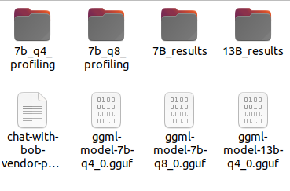

# Model: llama-2

## GGML:
- `7b_q4_profiling`: folder to run nsys analysis for 4-bit quantized llama-2 model with python scripts
- `7b_q8_profiling`: folder to run nsys analysis for 8-bit quantized llama-2 model with python scripts
- `chat-with-bob-vendor-prediction-device_name.txt` and the other 3 similar txt files: Prompt templates we discovered
- `ggml-model-7b-q4_0.gguf` (need to self download from meta and convert using llama.cpp): 4-bit quantized llama-2 model
- `ggml-model-7b-q8_0.gguf` (need to self download from meta and convert using llama.cpp): 8-bit quantized llama-2 model
- `gpt_playaround_dataset.csv`: all in one dataset to test the LLM approach
- `Test.ipynb`: not necessary, but can be use to test the difference between prompts

## Commands (at the root of GGML folder):
1. Clone the repository:
git clone https://github.com/ggerganov/llama.cpp.git
2. Change directory:
cd llama.cpp
3. Install requirements:
python3 -m pip install -r requirements.txt
4. Convert the downloaded model:
python convert.py <path_to_your_downloaded_llama-2-7b_model>
5. Quantize the model:
./quantize <path_to_your_downloaded_llama-2-7b_model>/ggml-model-f16.gguf <path_to_your_downloaded_llama-2-7b_model>/ggml-model-q4_0.gguf q4_0
6. enter 7b_q4_profiling, example command can be:
python profiling_device_name.py
7. nsys command:
/usr/local/cuda/bin/nsys profile --stats true -t nvtx,cuda,cudnn -o my_report python profiling_netdisco.py

This picture shows where to output the quantized models. You will not be able to run the code if you do not put models there.

Then you can follow the `llama.cpp` instructions to convert meta’s original llama-2 models to `.gguf`
And you need to install CUDA enabled llama.cpp’s python binding to run the inference:

CUDACXX=/usr/local/cuda-12.2/bin/nvcc CMAKE_ARGS="-DLLAMA_CUBLAS=on -DCUDAToolkit_LIBRARY_DIR=/usr/local/cuda-12.2/lib64" FORCE_CMAKE=1 pip install llama-cpp-python --force-reinstall --no-cache-dir --verbose

If you succeeded, you will be able to run `Test.ipynb` or the script(s) in `7b_q4_profiling` or `7b_q8_profiling` by executing:
python filename.py
